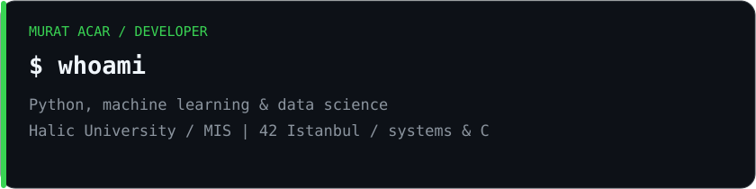
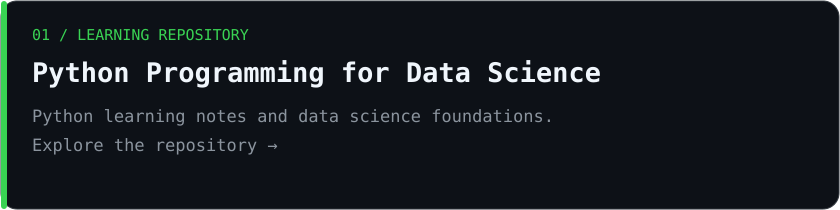
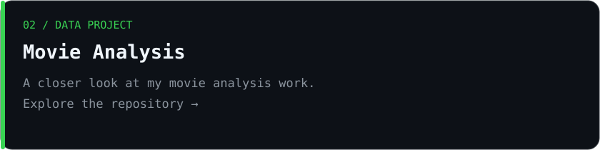

# Murat Acar
### Aspiring AI Engineer · ML & Data Enthusiast

Learning by building. Turning ideas and data into practical projects.

Computer Programming graduate from İstinye University, currently studying Management Information Systems at Haliç University. Building my AI/ML foundations through practical projects, alongside low-level programming at 42 Istanbul.

## Selected work

## Tech stack

**Languages**

**AI & Data**

**Tools & Platforms**

## GitHub activity

Contribution animation

 

## Connect & explore

---

Learn. Build. Understand. Improve.

